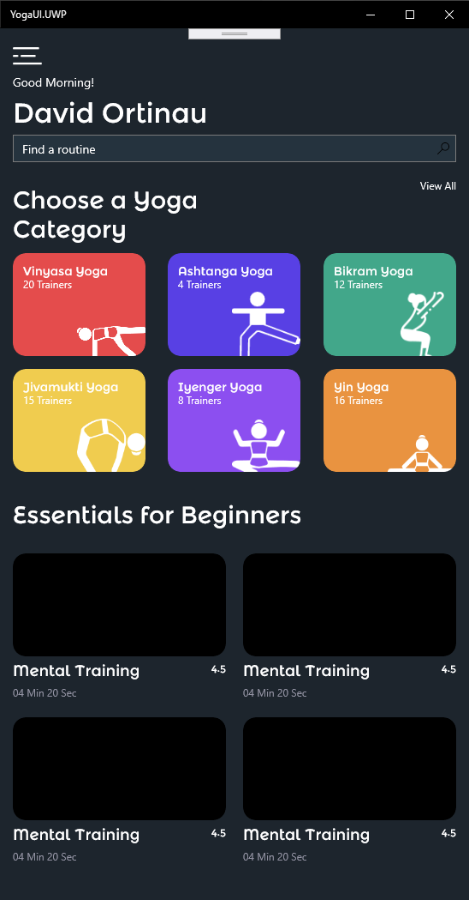

# YogaUI

A little UI exercise using C# UI, Xplat Images and Fonts, and LiveSharp.

Design Files: https://www.uplabs.com/posts/yoga-class-mobile-app-dark-version-xd

## Using

* [Xamarin.Forms 4.7 Nightly](https://github.com/xamarin/Xamarin.Forms/wiki/Nightly-Builds) especially C# UI
* [Resizetizer](https://github.com/Redth/ResizetizerNT) for xplat images
* [LiveSharp](https://www.livesharp.net/) for C# Hot Reload & VS Code

## Screenshots

